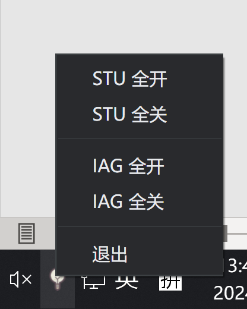

## 介绍

该软件启动后默认展示B区的三维模型，通过预设的区域展示相应办公室的照明状态。同时，软件会在Windows任务栏中创建图标，便于在后台运行时快速访问。用户可通过鼠标左键拖拽及点击相应区域的桌面控制灯光照明。点击右上角的红色按钮，软件将退至后台运行。此时，右键点击任务栏图标可访问集成的区域一键开关。

软件通过调用局域网内的Home Assistant REST API 控制办公空间的照明。为避免测试时影响到9楼的照明，`hafounction.js`中的`light_control`函数已对ID进行特别处理。

> [!WARNING]  
> :warning: **重要提醒：请绝对不要上班时间尝试着控制一下9楼的灯光**  
> :warning: **重复操作可能导致照明突然闪烁，影响同事工作**  
> :warning: **虽然故障可能不是我直接引起，但9楼的同事可能会误认为是我在操作，造成不必要的误会而导致我被打 :sob:**

## 软件使用教程

从release中下载的文件直接解压后，进入文件夹双击`MyApp.exe`文件即可运行。请确保电脑已连接至`Seeed`的办公网络。

软件启动后将显示一个3D模型，用户可以点击模型开启或关闭特定区域的灯光。目前，此功能仅限于9楼B区STU位置。

软件启动后，右下角任务栏会出现一个小图标。右键单击该图标将显示控制菜单，这是日常使用中的主要控制方式。软件主界面右上角有两个按钮，第一个为设置按钮，点击后会弹出窗口供用户选择区域。选定后，点击提交，桌面右下角的菜单栏将更新以便控制。右上角的红色按钮用于将软件退至后台。

<div align="center">
    
</div>

## 源代码编译与安装

请先安装Node.js，然后在项目根目录下运行以下命令安装依赖：
```
npm install
```
随后，运行以下命令启动项目：
```
npm start
```
若需编译成exe文件，可在项目根目录下运行：
```
npm run package-win
```
注意：electron包的安装可能因网络问题报错，请尝试 Proxy 解决。

### 功能列表

- 实时渲染的办公环境模型交互界面
- 精细控制的区域设置
- 可自定义的任务栏快捷控制
- 低性能开销，适合长期后台运行
- 窗帘自动开合功能

## 目前的进度

- 已完成9楼B区STU部分的功能开发，下一步将集中于IAG区域的控制与集成。 

## 目前已知的问题

1. **软件启动后不会同步灯光的实际状态，初始状态默认为开启。这可能导致软件显示的灯光状态与实际状态不一致，*首次点击可能无效*。**
2. **缺少A区的gltf模型。由于开发时间限制，短期内难以补充。欢迎具备Blender或其他3D软件技能的小伙伴们加入项目。**
